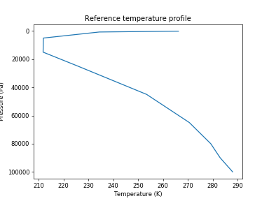

# NMF3D

#### Tridimensional Normal Mode Functions

##### About the software:
 - NMF3d includes a Python and a Matlab version
 - Works with both python 2 and 3
 - Numpy and Scipy are required; netCDF4 is recommended


##### References:

  <div style="width:90%; font-size: small">

 - A. Kasahara (1984). The Linear Response of a Stratified Global Atmosphere to
   Tropical Thermal Forcing, J. Atmos. Sci., 41(14). 2217--2237.
   doi: `10.1175/1520-0469(1984)041<2217:TLROAS>2.0.CO;2`


 - P. N. Swarztrauber and A. Kasahara (1985). The vector harmonic analysis of
   Laplace's tidal equations, SIAM J. Sci. Stat. Comput, 6(2), 464-491. doi: `10.1137/0906033`

 - A. Kasahara (1976). Normal modes of ultralong waves in the atmosphere, Mon. Weather Rev.,
   `104(6), 669-690. doi: 10.1175/1520-0493(1976)104<0669:NMOUWI>2.0.CO;2`

 - Y. Shigehisa (1983). Normal Modes of the Shallow Water Equations for Zonal Wavenumber Zero,
 J. Meteorol. Soc. Jpn., 61(4), 479-493. doi: `10.2151/jmsj1965.61.4_479`

 - A. Kasahara (1978). Further Studies on a Spectral Model of the Global Barotropic
   Primitive Equations with Hough Harmonic Expansions, J. Atmos. Sci., 35(11), 2043-2051.
  doi: `10.1175/1520-0469(1978)035<2043:FSOASM>2.0.CO;2`

</div>

#### Tutorial

##### 1. Vertical space/time mean profile of temperature from a global dataset

The mean profile of temperature is needed for the NMF3d. Folder data (nmf3d.datafolder)
contains some ERA-INTERIM temperature files that can be used. These are very low space/time
resolution files just for testing.

```
import nmf3d
f=nmf3d.datafolder+'/T*.nc*'

import os, glob
files=glob.glob(f)
files.sort()
```

The profile can be calculated with the function nmf3d.calc.profile which returns the temperature (K) and pressure (Pa).

```
t,lev_mb=nmf3d.calcs.profile(files)
lev=lev_mb*100 # Pa
%matplotlib inline
import pylab as pl
pl.plot(t,lev)
pl.ylabel('Pressure (Pa)')
pl.xlabel('Temperature (K)')
pl.title('Reference temperature profile')
pl.gca().invert_yaxis()
```


